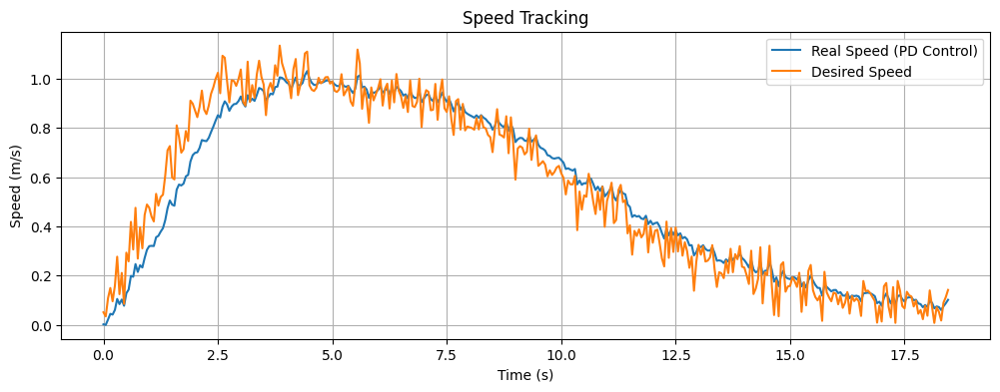

# Two-wheeled differential drive robot backstepping control

## Overview

This project presents the modeling and control of a two-wheeled differential drive robot using a **backstepping control approach**. The robot is required to follow a dynamically generated trajectory that avoids both static and moving obstacles, using **Artificial Potential Fields (APF)** for navigation. The objective is to regulate the robot’s position and orientation by controlling the torques of the two independently actuated DC motors (one per wheel), taking into account real-world complexities such as **slippage**, **motor lag**, and **actuator latency**.

The core focus of the project is the comparison between a **PD controller** and a **backstepping controller**, with the latter designed to **smooth torque profiles** and enhance tracking robustness under model uncertainty and noise. The system is modeled with **nonlinear dynamics** and discrete-time updates, including both **longitudinal** and **lateral slippage**, making it a practical testbed for advanced nonlinear control techniques.

---

## Task Definition

- **Given:**
The robot is provided with a trajectory generated by artificial potential fields, which account for the goal, obstacles (including moving ones), and workspace boundaries.
- **Achieved:**
The robot's linear speed, acceleration, angular speed, and angular acceleration are controlled. The control is based on the torque derivative equations of DC motors, with both motors (left and right wheels) controlled simultaneously. The robot's movement is affected by random longitudinal and lateral slippages, making the control task more realistic and challenging.

---

## Plant Definition

The plant is a planar **differential drive mobile robot**. It consists of two independently actuated wheels mounted on either side of the robot, separated by a fixed wheelbase. The robot operates on a 2D plane with a bounded workspace and is subject to slippage.

### State Vector

`s = [x, y, θ, v, ω]`

where:
- `x, y`: robot position in world coordinates  
- `θ`: heading angle  
- `v`: forward (linear) velocity  
- `ω`: angular (rotational) velocity

### Robot Kinematics and Dynamics (State Derivatives with Slippage)

The system evolves over time according to the following nonlinear discrete-time dynamics, which include both **longitudinal** and **angular slippage**:

v       = v_cmd - μ · v_cmd · dt + slip_v  
ω       = ω_cmd - μ_ω · ω_cmd · dt + slip_ω  
ẋ       = v · cos(θ)  
ẏ       = v · sin(θ)  
θ̇       = ω

where:
- `v_cmd`, `ω_cmd`: Commanded linear and angular velocities  
- `μ`, `μ_ω`: Slippage coefficients (longitudinal and angular)  
- `slip_v`, `slip_ω`: Zero-mean Gaussian noise terms  
- `dt`: Simulation time step

### Control Vector

`a = [τ_L, τ_R]`

where:
- `τ_L`: Torque applied to the left wheel  
- `τ_R`: Torque applied to the right wheel

### Motor Dynamics

Each motor torque follows a first-order lag dynamic model:

τ̇_L = γ * (τ_L,des - τ_L)

τ̇_R = γ * (τ_R,des - τ_R)

where `τ_L` and `τ_R` are actual torques, and `τ_L,des`, `τ_R,des` are desired torques.

### Speed Smoothing

To avoid abrupt speed changes:

$$
v_{cmd} =
\begin{cases}
\min(v_\text{cmd} + a, v_\text{desired}) & \text{if } v_\text{cmd} < v_\text{desired} \\
\max(v_\text{cmd} - a, v_\text{desired}) & \text{otherwise}
\end{cases}
$$

where $a$ is the acceleration increment.

### Plant Parameters

  - \(m = 2.0 \, \{kg}\): robot mass  
  - \(r = 0.05 \, \{m}\): wheel radius  
  - \(w = 0.2 \, \{m}\): wheelbase  
  - $\gamma = 0.15 , {s}\)$: motor time constant  
  - $\mu, \mu_{\omega}$: slippage coefficients  
  - \(dt = 0.01 \, s\): simulation time step
  
---

### Forces

**Attractive Force:**

$$
F_{att} = k_{att} (q_{goal} - q), ||q_{goal} - q|| \leq r_{att}
$$

**Vertical Force:**

$$
F_y =\begin{cases}
-k_{vert} (1 + a_{v} v) |y| & y \geq 0 \\
k_{vert} (1 + a_v v) |y| & y \leq 0 \\
0 & y = 0 \end{cases}
$$

where $k_{vert} = k_{vert_{0}} (1 + \alpha_v v)$

**Horizontal Force:**

$$
F_x = k_{horiz} (1 + a_{h} v) \frac{10 - x}{10}
$$

where $k_{horiz} = k_{horiz_{0}} (1 + \alpha_h v)$

**Repulsive Force:**

$$
F_{rep} =
\begin{cases}
k_{rep} \left(\frac{1}{d} - \frac{1}{d_0}\right) \frac{q - q_o}{d} & d \leq d_0 \\
0 & d > d_0
\end{cases}
$$

where $d = \|\mathbf{q} - \mathbf{q}_o\|$

**Vortex Force:**

$$
F_{vortex} =
\begin{cases}
k_{vortex} {p_\perp}{d^2} & {if above obstacle} \\
-k_{vortex} {p_\perp}{d^2} & {if below obstacle}
\end{cases}
$$

where $p_\perp = [y, -x]$

**Variables:**

- $q$: Robot position
- $q_{goal}$: Goal position
- $q_o$: Obstacle position
- $k_{att}, k_{vert}, k_{horiz}, k_{rep}, k_{vortex}$: Field gains
- $d_0$: Repulsion threshold

---

## Artificial Potential Fields Animation

## PD DC Motors Control

### Desired Velocities and Accelerations

From the trajectory:

$$
v_d[i] = \frac{\sqrt{(x_i - x_{i-1})^2 + (y_i - y_{i-1})^2}}{dt}
$$

$$
\theta_d[i] = \arctan2(y_i - y_{i-1}, x_i - x_{i-1})
$$

$$
\omega_d[i] = \frac{\theta_d[i] - \theta_d[i-1]}{dt}
$$

$$
\dot{v}_d[i] = \frac{v_d[i] - v_d[i-1]}{dt}
$$

$$
\dot{\omega}_d[i] = \frac{\omega_d[i] - \omega_d[i-1]}{dt}
$$

### PD Control Law

- **Errors:**

$$
e_v = v - v_\text{ref}
$$

$$
e_\omega = \omega - \omega_\text{ref}
$$

$$
e_{\dot{v}} = \dot{v} - \dot{v}_\text{ref}
$$

$$
e_{\dot{\omega}} = \dot{\omega} - \dot{\omega}_\text{ref}
$$
- **PD control for torque derivatives:**

$$
\tau_\text{sum,des} = -(K_{p,v} e_v + K_{d,v} e_{\dot{v}}) \frac{2m}{r}
$$

$$
\tau_\text{diff,des} = -(K_{p,\omega} e_\omega + K_{d,\omega} e_{\dot{\omega}}) \frac{mw}{r}
$$

$$
\tau_{L,\text{des}} = 0.5 (\tau_\text{sum,des} - \tau_\text{diff,des})
$$

$$
\tau_{R,\text{des}} = 0.5 (\tau_\text{sum,des} + \tau_\text{diff,des})
$$
- **Motor torque update (first-order lag):**

$$
a_L = \gamma (\tau_{L,\text{des}} - \tau_L)
$$

$$
a_R = \gamma (\tau_{R,\text{des}} - \tau_R)
$$

$$
\tau_L \leftarrow \tau_L + dt \cdot \frac{1}{\gamma} (-\tau_L + a_L)
$$

$$
\tau_R \leftarrow \tau_R + dt \cdot \frac{1}{\gamma} (-\tau_R + a_R)
$$
- **Robot acceleration from torques:**

$$
\dot{v} = \frac{r}{2m} (\tau_L + \tau_R)
$$

$$
\dot{\omega} = \frac{r}{mw} (\tau_R - \tau_L)
$$

---

## Backstepping DC Motors Control

### Desired Velocities and Accelerations

Same as in PD control.

### Backstepping Control Law

- **Errors:**

$$
e_v = v - v_\text{ref}
$$

$$
e_\omega = \omega - \omega_\text{ref}
$$

$$
e_{\dot{v}} = \dot{v} - \dot{v}_\text{ref}
$$

$$
e_{\dot{\omega}} = \dot{\omega} - \dot{\omega}_\text{ref}
$$

#### Lyapunov Function: Construction and Explanation

To ensure stability of the closed-loop system using backstepping, we construct a Lyapunov function that penalizes deviations from the desired velocity and acceleration. The Lyapunov function is chosen as the sum of the squared errors for both linear and angular velocities and accelerations:

$$
V = \frac{1}{2} e_v^2 + \frac{1}{2} e_\omega^2 + \frac{1}{2} e_{\dot{v}}^2 + \frac{1}{2} e_{\dot{\omega}}^2
$$

**How this Lyapunov function is constructed:**

- The terms $e_v$ and $e_\omega$ represent the errors between the actual and reference (desired) linear and angular velocities.
- The terms $e_{\dot{v}}$ and $e_{\dot{\omega}}$ represent the errors between the actual and reference (desired) linear and angular accelerations.
- By squaring these errors and summing them, the function $V$ is always non-negative and is minimized (i.e., zero) only when all errors are zero.
- This form is standard in control theory for tracking problems, as it directly quantifies the deviation from the desired trajectory in both velocity and acceleration domains.

The backstepping control law is then designed to ensure that $V$ decreases over time, driving all errors to zero.

**Backstepping Control Law:**

- Compute desired accelerations:

$$
v_{dot,des} = \dot{v_{ref}} - k_1 e_v
$$

$$
\omega_{dot,des} = \dot{\omega_{ref}} - k_2 e_\omega
$$
- Convert to desired torques:

$$
\tau_{sum,des} = \frac{2m}{r} v_{dot,des}
$$

$$
\tau_{diff,des} = \frac{mw}{r} \omega_{dot,des}
$$

$$
\tau_{L,\text{des}} = 0.5 (\tau_\text{sum,des} - \tau_\text{diff,des})
$$

$$
\tau_{R,\text{des}} = 0.5 (\tau_\text{sum,des} + \tau_\text{diff,des})
$$
- For the motor torque dynamics, the backstepping control includes additional terms:

$$
a_L = \gamma (\tau_{L,\text{des}} - \tau_L) - k_3 e_{\dot{v}}
$$

$$
a_R = \gamma (\tau_{R,\text{des}} - \tau_R) - k_4 e_{\dot{\omega}}
$$
- Update motor torques:

$$
\tau_L \leftarrow \tau_L + dt \cdot \frac{1}{\gamma} (-\tau_L + a_L)
$$

$$
\tau_R \leftarrow \tau_R + dt \cdot \frac{1}{\gamma} (-\tau_R + a_R)
$$
- Update robot velocities and pose as in the PD control.

$$
\dot{v} = \frac{r}{2m} (\tau_L + \tau_R)
$$

$$
\dot{\omega} = \frac{r}{mw} (\tau_R - \tau_L)
$$

$$
v \leftarrow v + \dot{v} \cdot dt
$$

$$
\omega \leftarrow \omega + \dot{\omega} \cdot dt
$$

$$
x \leftarrow x + v \cos(\theta) \cdot dt
$$

$$
y \leftarrow y + v \sin(\theta) \cdot dt
$$

$$
\theta \leftarrow \theta + \omega \cdot dt
$$

## Results

### PD control

### Backstepping control

*To be completed.*

